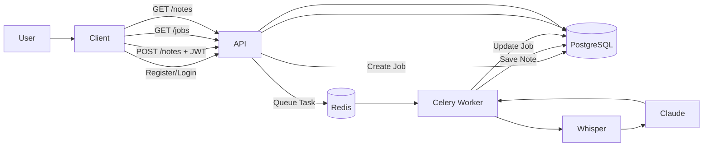
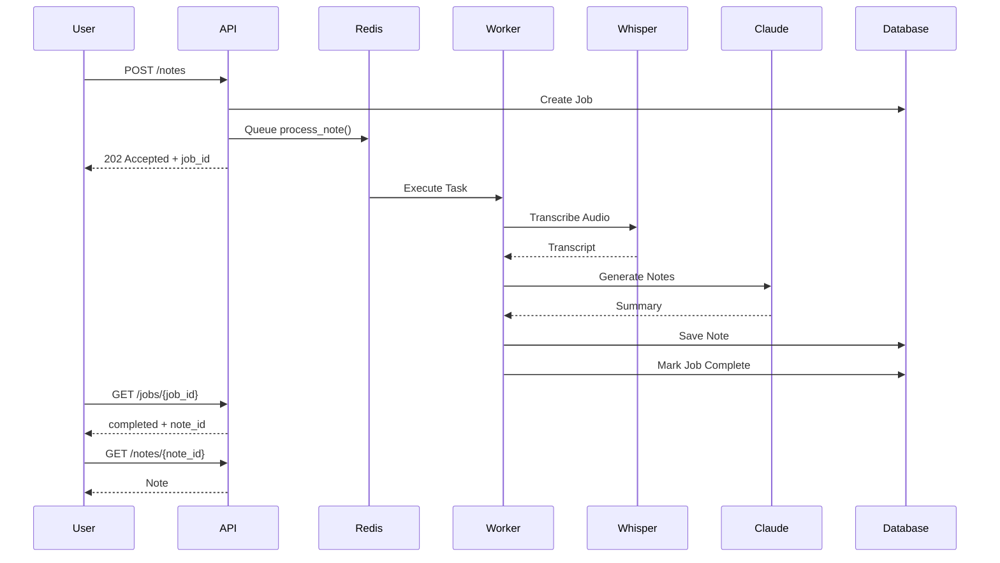

# AI Notes

AI Notes is an asynchronous AI-powered meeting notes backend built with FastAPI, Celery, Redis, PostgreSQL, Whisper and Anthropic Claude.

Users upload an audio recording, which is processed asynchronously in the background. The API immediately returns a job ID, allowing clients to poll for progress while the audio is transcribed and summarised.

## Features

- JWT Authentication
- User accounts
- Audio transcription using Whisper
- AI meeting summaries using Anthropic Claude
- Asynchronous background processing with Celery
- Redis message queue
- Job status polling
- Persistent note storage

## How It Works

1. The user uploads an audio recording to `POST /notes`.
2. FastAPI creates a new processing job with status `pending`.
3. The API enqueues a background task using Redis and Celery.
4. The API immediately returns a `job_id` to the client.
5. A Celery worker processes the audio:
   - Transcribes the audio using Whisper.
   - Generates structured meeting notes using Anthropic Claude.
   - Saves the generated note to PostgreSQL.
   - Updates the job status to `completed`.
6. The client polls `GET /jobs/{job_id}` until processing finishes.
7. Once completed, the client retrieves the generated note using `GET /notes/{note_id}`.

## Tech Stack

| Layer | Technology |
|--------|------------|
| Backend | FastAPI |
| Database | PostgreSQL (Supabase) |
| ORM | SQLAlchemy |
| Authentication | JWT |
| Queue | Redis |
| Background Worker | Celery |
| AI | OpenAI Whisper |
| LLM | Anthropic Claude |
| Validation | Pydantic |

## Architecture



## Sequence Diagram



### Job Status
pending -> transcribing -> summarising -> saving -> completed/failed

## Architecture Patterns

- Repository Pattern
- Service Layer
- Background Task Queue
- JWT Authentication
- Dependency Injection (FastAPI)

## Project Structure

```text
backend/
│
├── api/
├── core/
├── models/
├── repositories/
├── schemas/
├── services/
├── worker/
│
└── main.py
```

## API Endpoints

### Health

| Method | Endpoint | Auth | Description |
| --- | --- | --- | --- |
| GET | `/health` | No | Health check |

### Authentication

| Method | Endpoint | Auth | Description |
| --- | --- | --- | --- |
| POST | `/auth/register` | No | Register a new user |
| POST | `/auth/login` | No | Login and receive a JWT access token |

### Notes

| Method | Endpoint | Auth | Description |
| --- | --- | --- | --- |
| POST | `/notes` | Yes | Upload audio and start note processing |
| GET | `/notes` | Yes | List the authenticated user’s notes |
| GET | `/notes/{note_id}` | Yes | Get a specific note |
| DELETE | `/notes/{note_id}` | Yes | Delete a specific note |

### Jobs

| Method | Endpoint | Auth | Description |
| --- | --- | --- | --- |
| POST | `/jobs` | Yes | Create a test job |
| GET | `/jobs/{job_id}` | Yes | Get processing status for a job |

### Example Job Response

```json
{
  "job_id": "de97ccac-a113-42eb-80d1-f58b00530e2f",
  "status": "completed",
  "note_id": "4e8d1a67-f5bd-478a-b079-2a0c4cb2c356",
  "completed_at": "2026-06-29T20:14:00Z"
}
```

## Running Locally
### Clone Repository

```bash
git clone https://github.com/aad1tshah1/ai_notes.git
cd ai_notes
```

### Create and activate a virtual env
```bash
python -m venv .venv
source .venv/bin/activate
```

### Install dependencies
```bash
pip install -r requirements.txt
```

### Create .env file
```bash
ANTHROPIC_API_KEY=
DATABASE_URL=
SECRET_KEY=
ALGORITHM = 
```

(You can generate a SECRET_KEY: python -c "import secrets; print(secrets.token_hex(32))")

### Start Redis server
```bash
redis-server
```

### Check Redis is running
```bash
redis-cli ping


Expected Response:
PONG
```

### Start the Celery worker from the backend/
```bash
cd backend
celery -A worker.celery_app.celery worker --loglevel=info --pool=solo
```

> **Note:** `--pool=solo` is recommended on macOS because Whisper/PyTorch may crash with Celery's default prefork worker pool.

### Start FastAPI
```bash
cd backend
python -m uvicorn main:app --reload
```

### Open Swagger Docs
```bash
http://localhost:8000/docs
```

## Example Workflow

1. Register a new user.
2. Login to obtain a JWT.
3. Authorize requests using the JWT.
4. Upload an audio recording.
5. Receive a job ID.
6. Poll `/jobs/{job_id}`.
7. Once completed, retrieve the generated note.

## Future Improvements

- React frontend
- Docker Compose
- Kubernetes deployment
- WebSocket updates instead of polling
- File storage using Supabase Storage
- Retry failed jobs
- Email notifications